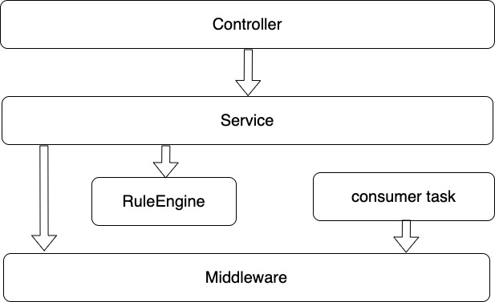
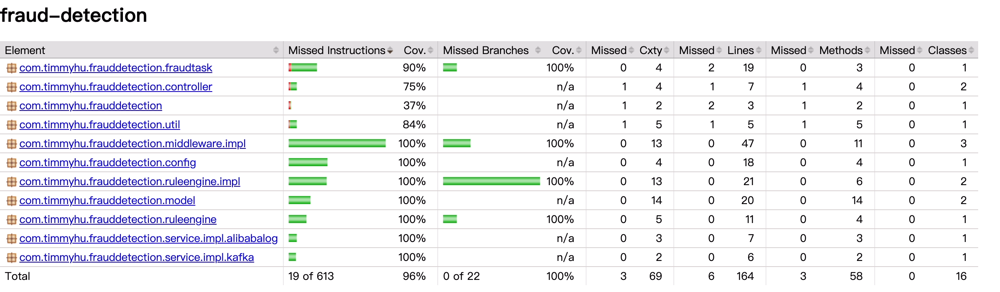

# Application Structure
This repository contains two top level subdirectories:
- fraud-detection: Source code based on Spring and SpringBoot
  * src/main/com/timmyhu/frauddetection/controller     Spring MVC REST API endpoints
  * src/main/com/timmyhu/frauddetection/service        Service layer
  * src/main/com/timmyhu/frauddetection/ruleengine     Fraud detection rule engine layer  
  * src/main/com/timmyhu/frauddetection/fraudtask      Consumer task layer for fraud detection
  * src/main/com/timmyhu/frauddetection/middleware     Middleware layer
  * Dockerfile   Docker image configuration
  * deployment.yaml  Kubernetes deployment configuration
  * service.yaml  Service exposure configuration
  * hpa.yaml     Horizontal Pod Autoscaler configuration

- resources: Documentation, images, coverage reports, etc.

Technology Stack:
- Spring
- SpringBoot SpringMVC
- Alibaba Message Service
- Alibaba Log Service
- Fastjson
- Logback

# Installation Guide

- Build and package with Maven
```bash
mvn clean package
```

- Login to Alibaba Cloud Container Registry
```bash
docker login --username=18011988699 crpi-t5ahmm8it9ift170.cn-hangzhou.personal.cr.aliyuncs.com
```

- Build Docker image locally
```bash
docker build -t crpi-t5ahmm8it9ift170.cn-hangzhou.personal.cr.aliyuncs.com/timmyhu/fraud_detection:0.0.2 .
```

- Push to Alibaba Cloud Image Registry
```bash
docker push crpi-t5ahmm8it9ift170.cn-hangzhou.personal.cr.aliyuncs.com/timmyhu/fraud_detection:0.0.2
```

- Deploy to Alibaba Cloud Service
```bash
kubectl apply -f deployment.yaml
```

- Deploy external Service
```bash
kubectl apply -f service.yaml
```

- Enable HPA auto-scaling
```bash
kubectl apply -f hpa.yaml
```

# System Design
## Application Layered Architecture
<center></center>
Benefits of layered architecture:

- Clear hierarchy and reasonable design
- Each layer handles its own business logic
- RuleEngine module is decoupled for easy replacement with other algorithms like AI
- Interface-based programming for loose coupling and high cohesion (e.g. pluggable replacement from Alibaba Cloud to AWS)
- Stateless design pattern supporting resilience and dynamic scaling

## Devops R&D and Deployment Topology
<center></center>

Integrated Devops workflow using githook for code-as-service development

# Testing Guide
## Automated Integration
An automated integration test case is provided in the code repository
Run directly: [Integration Test Code](fraud-detection/src/test/java/com/timmyhu/frauddetection/intergratetest/FraudDetectionIntegrationTest.java)
## Manual Testing
Simulate a transaction:
```bash
curl -X POST \
  http://121.41.68.171/transaction \
  -H 'Content-Type: application/json' \
  -d '{
    "transactionId": 1000,
    "fromAccount": "testFrom",
    "toAccount": "testTo", 
    "amount": 80000
  }'
```
Check if the transaction was been detected as fraud:
```bash
curl -X GET "http://121.41.68.171/detection-record/list" \
     -H "User-Agent: Mozilla/5.0" \
     -H "Accept: application/json"
```
## Unit Test Coverage
JUnit test coverage exceeds 95%
[View Coverage Report](resources/jacoco/index.html)

<center></center>

## Resilience Testing
### Alibaba k8s Deployment Overview
<center></center>

### Alibaba k8s HPA Overview
<center></center>

### Resilience Verification
The stateless design ensures service continuity during outages or scaling. 
Manually terminate containers (not recommended in production due to single point of failure), 
then scale to 3 containers. 
Test transactions continue to work correctly and detect fraud:
```bash
curl -X POST \
  http://121.41.68.171/transaction \
  -H 'Content-Type: application/json' \
  -d '{
    "transactionId": 1000,
    "fromAccount": "testFrom",
    "toAccount": "testTo", 
    "amount": 80000
  }'
```
All integration tests passed during resilience verification
Run directly: [Integration Test Code](fraud-detection/src/test/java/com/timmyhu/frauddetection/intergratetest/FraudDetectionIntegrationTest.java)
